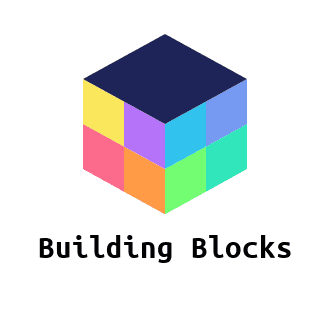

#  Building Blocks

This app helps parents build today’s kids into tomorrow’s money responsible adults. 

## Table of contents

* [About this project](#about-this-project)
* [Project requirements](#project-requirements)
* [Live](#live)
* [Structure of the project](#structure-of-the-project)
* [Logo](#logo)
* [Screenshots](#screenshots)
* [Technologies used to create app](#technologies-used)
* [How to use the app](#how-to-use-app)
* [Form input validation](#form-input-validation)
* [Future enhancements](#future-enhancements)
* [Project contributers](#project-contributers)

##  About this project
Building Blocks is an app to helps parents to teach fiscally responsible kids.  Teaching kids at an early age to learn the benefits of reaching financial goals and teach the value of working hard. 

##  Project requirements

* Must use at least two APIs
* Use a Node and Express Web Server;
* Be backed by a MySQL Database an ORM (not necessarily Sequelize);
* Have both GET and POST routes for retrieving and adding new data;
* Be deployed using Heroku (with Data);
* Utilize at least one new library, package, or technology that we haven’t discussed;
* Have a polished frontend / UI;
* Have folder structure that meets MVC Paradigm;
* Meet good quality coding standards (indentation, scoping, naming).
* Must not expose sensitive API key information on the server

##  Live
App is available live through GitHub pages and Heroku

##  Structure of the project
<ul>
<li>BudgetApp</li>
<li>config</li>
    <ol>middleware</ol>
        <ol>isAuthenticaed.js</ol>
    <ol>config.json</ol>
    <ol>passport.js</ol>
<li>models</li>
    <ol>example.js</ol>
    <ol>index.js</ol>
    <ol>kid.js</ol>
    <ol>parent.js</ol>
    <ol>schema.sql</ol>
    <ol>task.js</ol>
<li>node_modules</li>    
<li>public</li>
    <ol>assets</ol>
    <ul> images</ul>
    <ul>js</ul>
        <ol>index.js</ol>
        <ol>login.js</ol>
    <ul> styles</ul>
        <ol>login.css</ol>
        <ol>styles.css</ol>
<li>routes</li>
    <ul>api-routes.js</ul>
    <ul>html-routes.js</ul>
<li>views</li>
    <ul>layouts</ul>
    <ul>main.handlebars</ul>
    <ul>404.handlebars</ul>
    <ul>index.handlebars</ul> 
    <ul>login.handlebars</ul>
    <ul>signup.handlebars</ul>  
<li>seeds.js</li>
<li>server.js</li>

##  Logo
We created our own unique logo using Hatchful.shopify. Hatchful.shopify is a free logo making site, that provides many different style types to make it your own.

##  Screenshots
Images of Building Blocks site

##  Technologies used to create the app
<li>HTML5</li>
<li>CSS</li>
<li>Heroku (https://id.heroku.com/)</li>
<li>Javascript (https://www.javascript.com/)</li>
<li>JQuery (https://jquery.com/)</li>
<li>Handlebars (https://handlebarsjs.com/)</li>
<li>Node JS (https://nodejs.org/)</li>
<li>Express (https://expressjs.com/)</li>
<li>Sequel (https://www.mysql.com/)</li>
<li>Passport (http://www.passportjs.org/)</li>

##  How to use app
<li>To start a parent signs up for the application, utilizing the sign up button.</li>
<li>Once the modal pops up, the parent adds the following inputs The input information added is name, user name, password and pin.<li>
<li>The input information added is name, user name, password and pin.</li>
<li>Once the user input is updated the the login modal will allow the parent to sign in with user name and password.</li>
<li>Once signed in the user is taken to the parent page.</li>
<li>Parents are then able to set up their child or childern with different pages.</li> 
<li>Once the child is added, the parent is able to select tasks name, value, and parent ID.</li>
<li>From the parents page the child is able to check out off the tasks completed.</li>
<li>The input information added is name, user name, password and pin.</li>

##  Form input validation
<li>The app uses form input validation for the user information to check or validate the following:</li>

<ul>The user has entered a value for every field that is, all fields are required.</ul>
<ul>This ensures that there are no empty or null values when the form is submitted.</ul> 
<ul>If the user tries to add information when there is an empty or null value.</ul>
<ul>The user enters name, email and creates password.</ul>
<ul>User information is sent to  for storage.</ul>

##  Future enhancements
<li>Provide different options for kids to earned money.</li>
<li>Add new application division for ages 13-18 teaching about credit cards, debt and using credit to your advantage.</li>

##  Project contributers
<li>Kyle - front end, handlebars, html, css</li>
<li>Angela - front end, styling, logo, read me</li>
<li>Michael - back end, routes, api's, user authentication</li>
<li>Jorge - back end/front end</li>